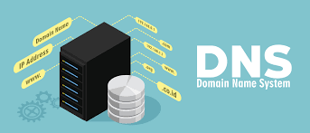

# DNS



## Integrantes 🙋

- Bautista García Pedro
- González Duran Erick
- Lázaro Martínez Annette Ariadna
- Meneses Rodríguez Paola Mariana
- Rojas Castillo Oscar 

## Dominio en Freenom 🆓

Para obtener el dominio, nos dirigimos a la página principal de freenom.com y buscamos el apartado "registrar un dominio"


Posteriormente, buscamos la disponibilidad de un dominio como se ve en la imagen, escogemos uno gratuito y procedemos al 'checkout'


En la siguiente ventana escogemos el máximo periodo gratuito disponible (12 meses) y damos click en 'continuar'


Luego, ingresamos algún correo (preferentemente institucional) en el apartado correspondiente y damos click en 'verificar mi dirección de correo'.


Luego de este paso, necesitamos ingresar a nuestro correo, abrir el email que nos envío la página, llenar nuestros datos de contacto para verificar la cuenta de correo y nuestra identidad, e iniciar sesión en freenom.com para comprobar que nuestro dominio se encuentre registrado correctamente.

## Configuración en máquina virtual 💻

### BIND
El *Berkeley Internet Name Domain* o BIND es el servidor de DNS más común para sistemas Unix con el cual implementamos nuestro proyecto.

#### Instalación de BIND 📦
Se puede utilizar el comando
`yum install bind*`

Con lo que se crearan los archivos de configuración que modificaremos.

#### Configuración del servidor principal 🛠️

En los archivos de configuración por defecto de nuestro equipo, es decir, en `/etc/` se creará un archivo `named.config` para la configuración del DNS resolver.

Primero, será necesario colocar un bloque de IPv4 en quienes confiamos, es decir, aquellas correspondientes a los otros equipos (mail, web, storage, directory y vpn), el local host y el DNS secundario (esclavo), del cual hablaremos más adelante.
Este bloque se realiza para evitar que cualquier usuario de todo el mundo pueda acceder al servicio, pues definimos nuestra lista de clientes confiables.

```
acl "trusted"{
        127.0.0.1;	//localhost
        3.21.52.197;	//dns
        3.20.143.7;	//mail
        18.117.38.39;	//web
        13.58.149.147;	//storage
        3.14.238.180;	//directory
        18.189.117.97;	//vpn
        104.156.225.38;	//nagios
        216.218.133.2;	//HE slave
	10.0.8.0/24;    //Bloque de direcciones pertenecientes a la VPN
};
```

Cabe mencionar que también debemos poner la IP de nuestro servidor (DNS).

El siguiente paso fue modificar el bloque 'options'
En este bloque se especifica el puerto del servidor (53) tanto para ipv4 como para ipv6, así como las rutas de ciertas especificaciones.
El puerto utilizado tanto para TCP como para UDP fue el 53, para lo cual se agregó la sentencia:

```
listen-on port 53 { 127.0.0.1; 172.31.8.201;};
```
Esto se puede comprobar con el comando netstat desde el servidor:


Fue necesario agregar las siguientes líneas con la configuración del DNS slave:
```	
	allow-query     { trusted; };
	allow-transfer  { 216.218.133.2; 104.156.225.38; 10.0.8.3; };
	allow-notify    { 216.218.130.2; };
```

En este mismo bloque se permitieron las búsquedas recursivas con la sentencia `recursion yes`

[`named.conf`](files/named.conf)

#### Configuración local 🔧

El siguiente archivo de configuración importante es `/etc/named/named.conf.local`.
En este archivo debemos agregar el nombre de la zona DNS (nuestro dominio) y agregar al DNS secundario (esclavo).

```
zone "planbecarios15.cf"{
        type master;
        allow-transfer
        { 216.218.133.2; 104.156.225.38; };
        notify explicit;
        also-notify
        { 216.218.130.2; };
        file "/etc/named/zones/db.planbecarios15.cf";
};
```

El archivo al que se hace referencia hasta el final del bloque debe crearse en la carpeta de zonas correspondiente.

[`named.conf.local`](files/named.conf.local)

#### Configuración de la zona de reenvío ⚙️

Se crea el directorio `/etc/named/zones` y el archivo `/etc/named/zones/db.planbecarios15.cf` al que se hizo referencia en el documento anterior.

En este archivo se especifican los registros de nuestro DNS, el primero de ellos es muy importante, pues es el registro SOA (Start of Authority o Autoridad de la zona), en él debemos especificar el nombre de nuestro dominio y es muy importante modificar el numero del serial cada vez que se realice un cambio en el archivo.

Seguido de lo anterior, se especifican los name-servers o glue-records del servidor secundario.

```
; name-servers - NS records
@        IN      NS      ns.planbecarios15.cf.
planbecarios15.cf.        IN      NS      ns2.he.net.
planbecarios15.cf.        IN      NS      ns3.he.net.
planbecarios15.cf.        IN      NS      ns4.he.net.
planbecarios15.cf.        IN      NS      ns5.he.net.
```
Finalmente, se pueden especificar todos los demás registros necesarios para los otros servicios de los proyectos con registros A que apunten a sus IP públicas, registros CNAME que apunten a los registros A, y otros registros específicos como el TXT para web, el MX y el SPF para correo, entre otros. 

Esta configuración se facilitó con la utilización de Hurricane Electric Free DNS Management (dns.he.net), pues los teníamos ahí en un principio por la práctica hecha en clase.

Cabe mencionar que, cada vez que se modificó este archivo fue necesario utilizar las sentencias `sudo named-checkzone planbecarios15.cf /etc/named/zones/db.planbecarios15.cf` para saber si realizamos algún error de sintáxis, así como el comando `sudo systemctl restart named.service` para observar los cambios.

[`db.planbecarios15.cf`](files/db.planbecarios15.cf)

#### Configuración del DNS secundario 🔩

La configuración del DNS secundario también se realizó con HE, agregando la misma configuración del archivo db.planbecarios15.cf se realizó en HE, una vez configurado de manera correcta, los registros anexados en el servidor primario también aparecen en el esclavo.


#### Verificación de los registros 📋

La verificación de los registros con dig se muestra a continuación.

- planbecarios15.cf


- nagios


- ns


- dns


- mail


- smtp


- imap


- web


- www


- wordpress


- vpn


- mysql


- mariadb


- postgresql


- directory


- ldap


- storage


- nfs


- redmine


- webmail


Así se ve el nagios con estos registros anexados:


### IPTables 📦️

Es un componente estándar de distribuciones GNU/Linux y tiene muchas utilidades, por ejemplo, para filtrar paquetes, aceptar o ignorar conexiones, analizar estados de los paquetes, entre otros.

Para utilizarlas, fue necesario instalar el componente con el siguiente comando:
```
sudo yum install iptables-services
```
Algunas de las opciones más utilizadas para establecer estas reglas fueron:

- -A para agregar una regla al final de la lista de reglas.
- -s para especificar una dirección de origen
- -j especifica la acción a ejecutar sobre un paquete (Ej. ACCEPT,DENY)

Las reglas implementadas se muestran a continuación:


- Las primeras instrucciones permiten las conexiones desde y hacia el localhost, esta es la única a donde permitimos salidas.

- La siguiente instrucción permite entradas de protocolo ICMP (Internet Control Message Protocol)

- Las siguientes instrucciones son permisivas para las entradas de los segmentos de IPv4 de la UNAM.

- Posteriormente, se declara la permisividad del protoloco VPN (Virtual Private Network)

- Luego, se aceptan los paquetes de los dominios de tonejito.

- A continuación, se permiten los paquetes de todas las IP's públicas de los servidores relacionados al proyecto (storage, web, etc.)

- Después, se permiten los paquetes de los nameservers utilizados en el esclavo, así como del propio DNS secundario.

- También es necesario abrir el puerto 53 para nuestro servicio tanto para tcp como para udp.

Finalmente se tienen que guardar las reglas con el comando `sudo service iptables save`

Para finalizar se tiene que iniciar el servicio de iptables con el comando `systemctl start iptables`

### Respaldo de la configuración 💾

Fue necesario realizar un script para programar el respaldo de nuestro archivo de configuración cada hora, dicha tarea será ejecutada por un nuevo usuario en el servidor: 'backuppc'

El contenido se muestra a continuación.

El archivo incluye la ruta del archivo que se respaldará y la ruta destino del respaldo.
Se utiliza la fecha y el hombre de host para nombrar el archivo y poder identificarlo más facilmente.
Finalmente, se muestra en pantalla un mensaje que especifica que se realizó el respaldo.
```
backup_files="/etc/named/zones/db.planecarios15.cf"
dest="/srv/backuppc/dns"
fecha=$(date+"$A_%d_%B_%T")
hostname=$(hostname -s)
archive_file="$hostname-$fecha-respaldo.db.planbecarios15.cf"
echo "Backing up $backup_files to $dest/archive_file"
echo "Backup finished"
echo $(date)
```
Cabe mencionar que el propietario del la carpeta `/etc/backuppc/dns` debe ser el nuevo usuario, por lo que se ejecutó:
`sudo chown backuppc:backuppc etc/backuppc/dns/`

Es necesario darle los permisos necesarios al archivo para que sea ejecutable.

La ejecución debe programarse para hacerse de manera periódica, en particular cada hora, por lo que modificamos las tareas programadas con el comando `sudo vim /etc/crontab`

Añadimos una línea que especifique que se ejecutará el comando en el minuto 0 de cada hora, todos los días, todos los meses.

Se pueden usar asteriscos para programación todas las hroas de todos los días de todos los meses, quedando una línea parecida a la siguiente:
`0 * * * * becarios /home/becarios/script_respaldo_dns.sh`

[`script_respaldo_dns.sh`](files/script_respaldo_dns.sh)

El equipo de storage es el encargado de acceder y almacenar estos respaldos, lo cual nos confirmaron como se muestra en la siguiente imagen:


## Configuración de VPN 💻
La configuración tanto del servidor como cada uno de los integrantes del equipo se realizó como se solicitó en la documentación del archivo VPN: https://gitlab.com/PBSC-AdminUNIX/2021/vpn/-/blob/main/manual_conexion_openvpn.md

Comprobamos que aparece el nombre de la interfaz tun0 correctamente después de la configuración:
Para el servidor:
```
3: tun0: <POINTOPOINT,MULTICAST,NOARP,UP,LOWER_UP> mtu 1500 qdisc pfifo_fast state UNKNOWN group default qlen 100
    link/none 
    inet 10.0.8.6/24 brd 10.0.8.255 scope global tun0
       valid_lft forever preferred_lft forever
    inet6 fe80::7490:86cb:1fc6:c498/64 scope link stable-privacy 
       valid_lft forever preferred_lft forever
```

Para un usuario ejemplo de nuestro equipo de DNS:
```
5: tun0: <POINTOPOINT,MULTICAST,NOARP,UP,LOWER_UP> mtu 1500 qdisc pfifo_fast state UNKNOWN group default qlen 500
    link/none 
    inet 10.0.8.7/24 scope global tun0
       valid_lft forever preferred_lft forever
    inet6 fe80::a50b:b20f:7f12:5455/64 scope link stable-privacy 
      valid_lft forever preferred_lft forever
```
También fue necesario agregar los registros correspondientes a la VPN al archivo de configuración de los registros.

## Referencias:

- Anicas, M. (2021, 22 abril). How To Configure BIND as a Private Network DNS Server on CentOS 7. DigitalOcean. https://www.digitalocean.com/community/tutorials/how-to-configure-bind-as-a-private-network-dns-server-on-centos-7
- D. (2014, 25 mayo). Using Hurricane Electric free DNS service for slaves, revisited. Asocial networking. https://stuff.baturin.org/post/86747317815
- Ellingwood, J., & Anicas, M. (2020, 16 noviembre). Cómo configurar BIND como servidor DNS de red privada en Ubuntu 18.04. DigitalOcean. https://www.digitalocean.com/community/tutorials/how-to-configure-bind-as-a-private-network-dns-server-on-ubuntu-18-04-es
- How to use free dns.he.net for slave DNS nameserver hosting | Abdussamad.com. (2012, 22 junio). ABDUSSAMAD.COM Linux Server Administration and Website Development. https://abdussamad.com/archives/525-How-to-use-free-dns.he.net-for-slave-DNS-nameserver-hosting.html
- M., R. (2014, 2 febrero). [Administra tu Servidor] ¿Cómo hacer copias periódicas en Linux? Utiliza la shell. BorrowBits. https://borrowbits.com/2014/01/como-hacer-copias-periodicas-de-archivos-en-linux-utiliza-tu-shell/
- Otalora Alarcón, J. (s. f.). ▷ Configurar servidor DNS con BIND9 en Ubuntu 🏅. JuanOA. Recuperado 17 de octubre de 2021, de https://www.juanoa.com/tutorial/configurar-servidor-dns-bind9/
