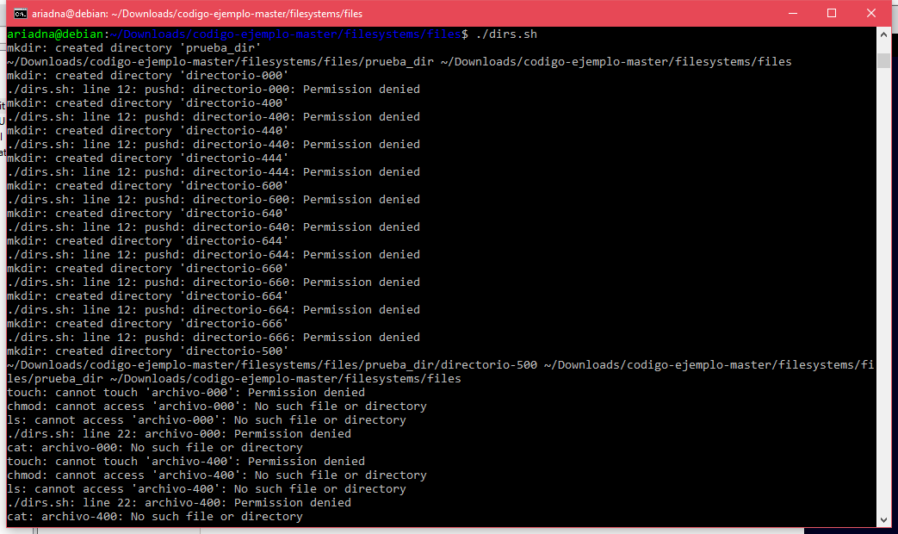
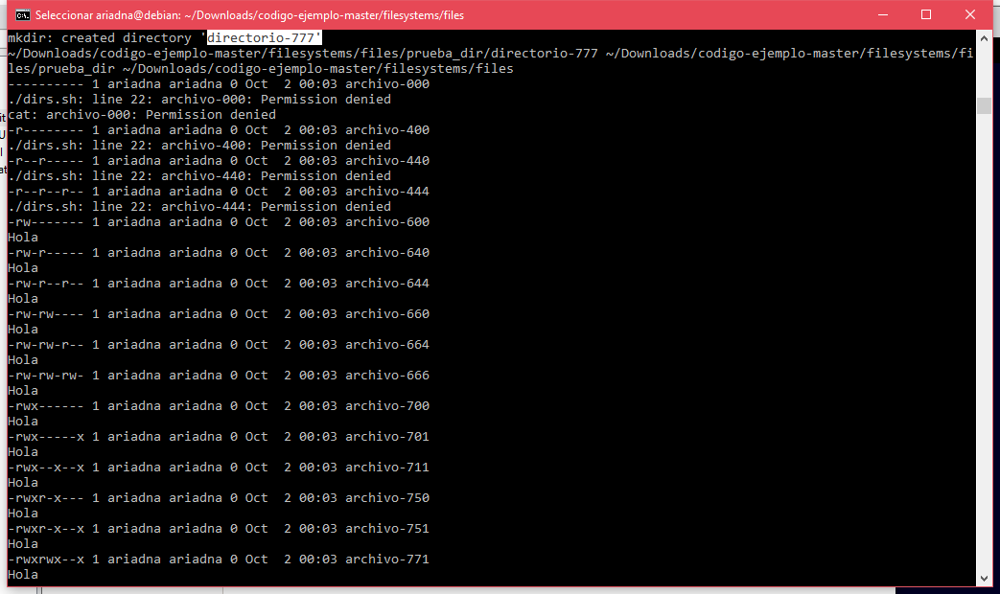
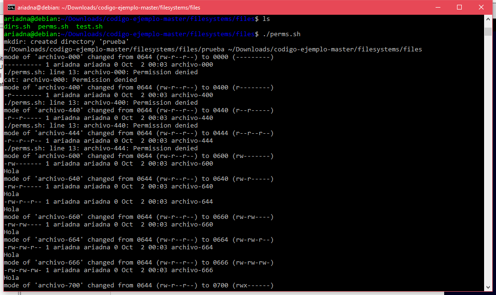
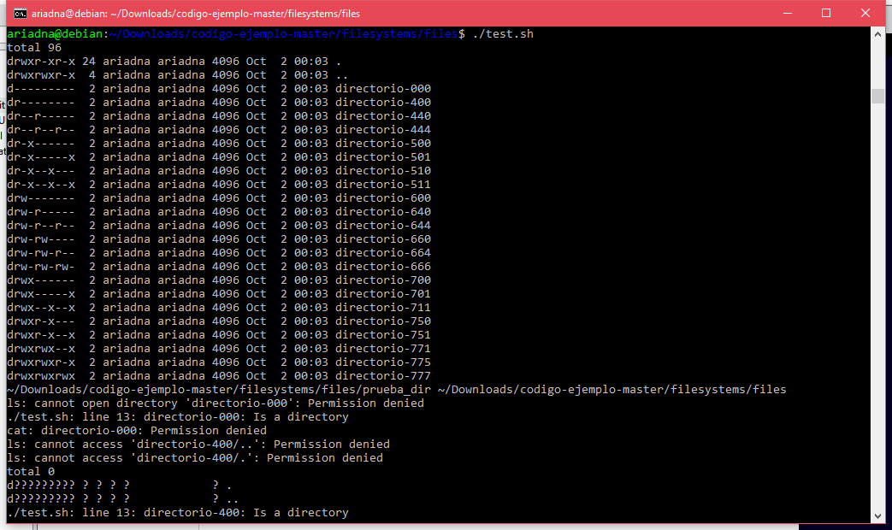
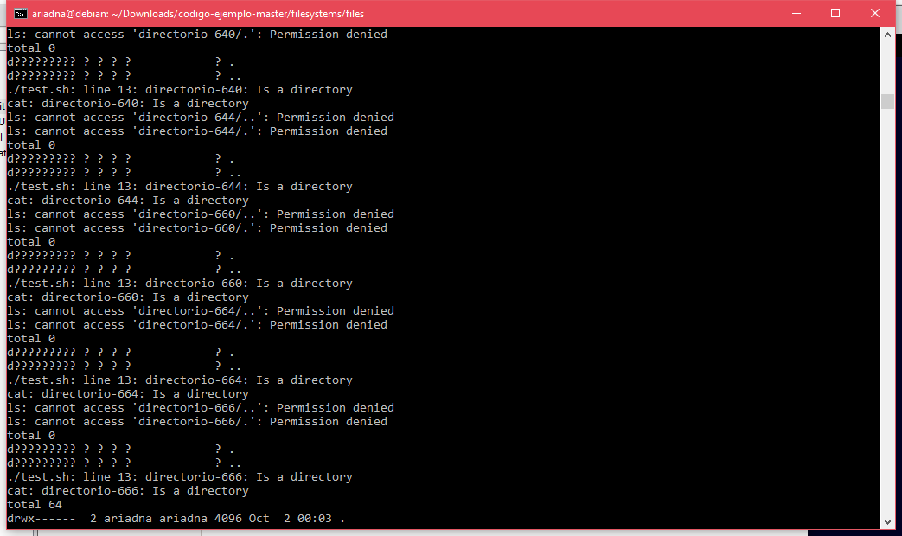
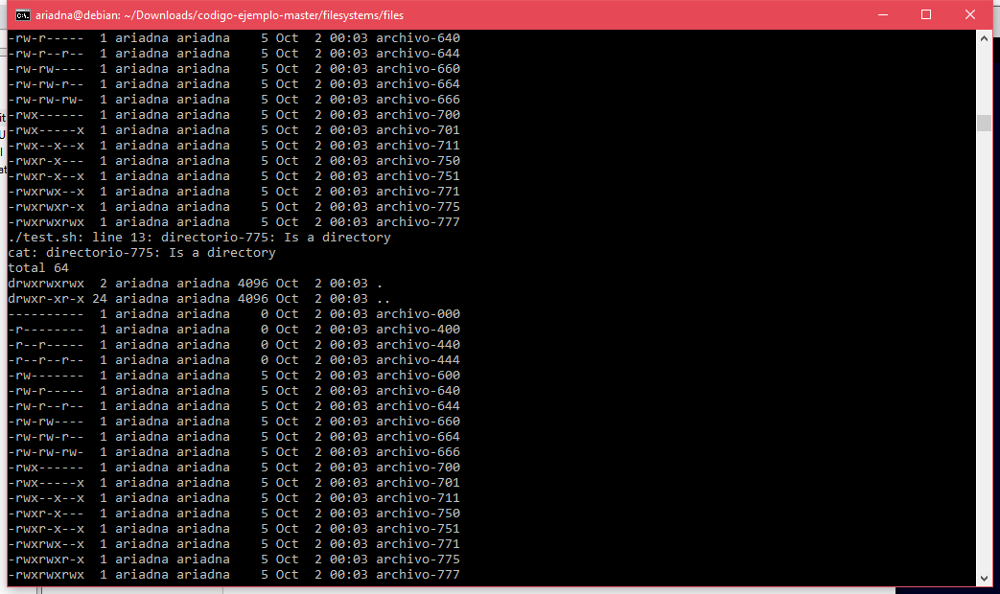
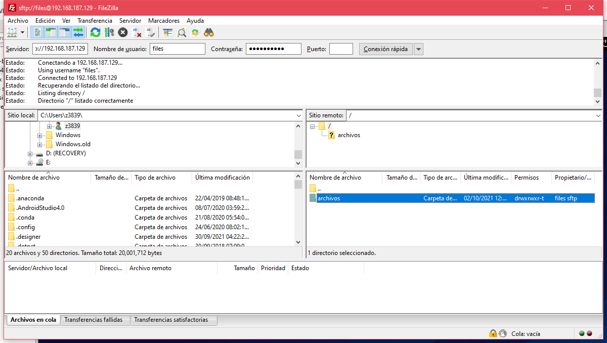

# Tareas DNS

## Imagen de muestra (Tarea 3)

## Liga hacia script para la creación de usuarios
- [`Users.sh`](files/Usuarios_vFinal.sh)

## Ejecucion de los scripts de permisos (Tarea 2):

1. Script dirs.sh

2. Script perms.sh

3. Script test.sh

## Practica de SFTP, conexión con FileZilla

## Link a llaves publicas:
- [`llave_pedro_rsa.pub`](files/llaves_publicas/llave_pedro_rsa.pub)
- [`llave_ariadna.pub`](files/llaves_publicas/llave_ariadna.pub)
- [`llave_erick.pub`](files/llaves_publicas/llave_erick.pub)
- [`llave_oscar.pub`](files/llaves_publicas/llave_oscar.pub)
